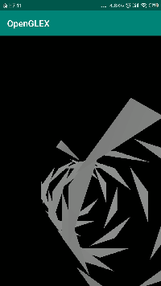
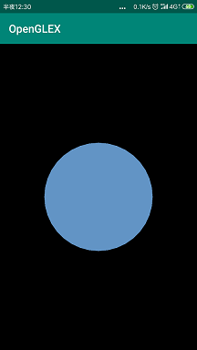
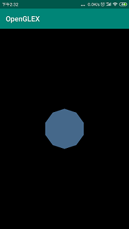

OpenGL-for-Androidandroid设备下openGL编程练习  
说明  
本项目旨在练习Android设备下的OpenGLES2.0从零开始的Demo程序，会不定期更新，期待大家的意见  
更新说明  
2019/01/23  
带颜色的基础三角形绘制（TriangleGLRender）  
带贴图的基础三角形绘制（TextureGLRender）  
2019/01/26  
增加矩阵变化和投影功能（MatrixGLRender）  
增加光源（LightGLRender）  
2019/01/27  
增加粒子效果  
2019/02/13  
增加三角形隧道特效（TunnelEffectRender）  
  
2019/02/28  
增加轮播图效果（CarouselGLRender）  
  
2019/03/01  
增加特殊图形绘制（ShapeGLRender）  
    